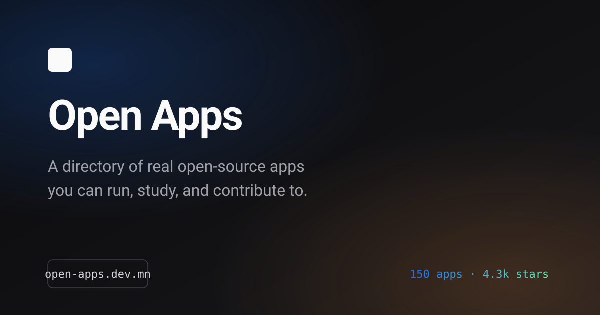

# Open Apps

> A curated directory of real open-source applications you can run, study,
> compare, and contribute to.

[](https://openappscout.com)
[](https://github.com/tortuvshin/open-apps/actions/workflows/validate-data.yml)
[](LICENSE)
[](https://astro.build)

[Explore the directory](https://openappscout.com/apps) ·
[Submit an app](https://openappscout.com/submit) ·
[Read the contribution guide](CONTRIBUTING.md)



## Why Open Apps?

GitHub is excellent when you already know what to search for. Traditional
awesome lists are useful for discovery, but a repository name and star count
rarely tell you whether a codebase is worth your time.

Open Apps adds the context developers need to make that decision:

- **Real applications, not toy projects** — complete products with meaningful
  scope, structure, and a clear license.
- **Practical discovery** — browse by category, platform, stack, activity, and
  maturity.
- **Useful learning signals** — understand what a project is best for, how
  difficult it is, and what architectural ideas it demonstrates.
- **Fresh repository metadata** — scheduled automation refreshes activity and
  contributor data through reviewable pull requests.
- **Open, portable data** — every catalog entry is a human-readable YAML file
  in this repository.

Stars are a signal, not a ranking system. The goal is to surface codebases
that are useful to read, run, learn from, or improve.

## What belongs in the directory?

Open Apps covers mobile, web, desktop, full-stack, and developer-facing
applications. A project must be a genuine application with a public source
repository, an identifiable license, at least 50 stars, and at least 50
lifetime commits.

The directory does not accept:

- tutorials, snippets, or one-screen demos;
- boilerplates and starter templates;
- package-only libraries and SDKs;
- archived projects with no enduring learning value;
- repositories with an unclear license or purpose.

See [CONTRIBUTING.md](CONTRIBUTING.md) for the complete curation and submission
rules.

## Catalog data

Each app lives in its own file:

```text
data/apps/<slug>.yml
```

Records combine human curation with GitHub metadata:

| Area | Examples | Maintained by |
| --- | --- | --- |
| App identity | name, description, category, platforms | contributors and curators |
| Technology | primary stack, languages, frameworks | contributors and curators |
| Repository | stars, forks, releases, activity | scheduled GitHub sync |
| Health | status, listing tier, cleanup candidacy | build and cleanup automation |
| Curation | learning value, caveats, review notes | curators |

The canonical field definitions, ownership rules, taxonomy IDs, and a complete
record example are documented in [docs/SCHEMA.md](docs/SCHEMA.md).

### Data pipeline

```text
data/apps/*.yml
      │
      ├─ validate schema and taxonomy
      ├─ normalize and score records
      └─ generate build-time JSON
             ├─ apps.index.json  → lightweight search and listing data
             ├─ apps.full.json   → complete app records
             └─ apps.json        → compatibility payload
                      │
                      └─ Astro static site → dist/
```

Files under `data/generated/` are derived artifacts unless explicitly tracked.
Edit the YAML source records rather than generated JSON.

## Local development

### Requirements

- [Node.js](https://nodejs.org/) 20 or newer
- [pnpm](https://pnpm.io/) 10.12.1 (the version is pinned in `package.json`)

### Start the site

```sh
git clone https://github.com/tortuvshin/open-apps.git
cd open-apps
corepack enable
pnpm install --frozen-lockfile
pnpm dev
```

The development server prints its local URL, normally
`http://localhost:4321`.

### Useful commands

| Command | Purpose |
| --- | --- |
| `pnpm dev` | Generate app data and start the Astro development server |
| `pnpm build` | Validate data, generate AI-readable files, and build the site |
| `pnpm preview` | Preview the production build locally |
| `pnpm check` | Run Astro and TypeScript checks |
| `pnpm test` | Run the Node.js test suite |
| `pnpm validate:data` | Validate every app record without building the site |
| `pnpm build:data` | Validate YAML and regenerate catalog JSON |
| `pnpm refresh:activity` | Refresh per-app activity from the GitHub API |
| `pnpm sync:contributors` | Refresh this repository's contributor metadata |

GitHub API scripts use `GITHUB_TOKEN` when available. Routine local development,
validation, and builds do not require a token.

## Project structure

```text
.
├── data/
│   ├── apps/             # one YAML source record per app
│   ├── generated/        # build-time catalog output
│   └── taxonomy/         # allowed categories, platforms, stacks, and channels
├── docs/
│   └── SCHEMA.md         # catalog schema and ownership contract
├── public/               # static assets and AI-readable endpoints
├── scripts/              # validation, generation, sync, and migration tools
├── src/
│   ├── components/       # Astro UI components
│   ├── data/             # typed catalog adapters and site metadata
│   ├── lib/              # search, scoring, formatting, and taxonomy helpers
│   └── pages/            # static routes and app detail pages
└── .github/workflows/    # validation and scheduled metadata maintenance
```

The site is built with [Astro](https://astro.build), TypeScript, and
[Tailwind CSS](https://tailwindcss.com/). It produces static assets in `dist/`
and is configured for deployment with Cloudflare Wrangler.

## Add or update an app

The fastest submission path is the
[web form](https://openappscout.com/submit). It drafts a YAML record from a
public GitHub URL; you review the metadata and open a pull request.

For a manual contribution:

1. Create or edit `data/apps/<slug>.yml`.
2. Keep human-owned fields under `app`, `stack`, and `curation`.
3. Do not hand-edit automation-owned `github` or `health` fields.
4. Run `pnpm validate:data`, `pnpm test`, and `pnpm build`.
5. Open a focused pull request.

Please read [CONTRIBUTING.md](CONTRIBUTING.md) before submitting data or code.
All participants must follow the [Code of Conduct](CODE_OF_CONDUCT.md).

## Automation

GitHub Actions keeps changes visible and reviewable:

- pull requests that touch catalog data run schema validation, data generation,
  and unit tests;
- app activity and GitHub-shaped metadata are refreshed daily;
- repository contributor statistics are refreshed weekly;
- stale-app candidates are reported weekly for curator review.

Scheduled jobs open pull requests when source data changes. They do not silently
remove catalog entries.

## AI-readable catalog

The deployed site publishes:

- [`llms.txt`](https://openappscout.com/llms.txt) — a compact guide to the site;
- [`llms-full.txt`](https://openappscout.com/llms-full.txt) — the expanded
  catalog for AI assistants and retrieval tools.

These files are generated from the same source data as the website.

## Project history

Open Apps grew from
[`open-source-flutter-apps`](https://github.com/tortuvshin/open-source-flutter-apps).
The original README-only collection is preserved in
[README-LEGACY.md](README-LEGACY.md), while this project evolves it into a
structured, searchable, multi-stack directory.

<!-- grove-readme:start -->
# Open Apps — a directory of real open-source applications

[](https://awesome.re)

Hand-picked apps worth running, studying, and extending.

Browse the directory → https://openappscout.com

## Why this list

Each app below is **actively maintained**, **well documented**, and
**useful in production**. Submit a new entry via the web form or
by opening a pull request against `data/records/`.

## Contents

- [Productivity](#productivity)
- [Finance](#finance)
- [Education](#education)
- [Tools](#tools)
- [Developer Tools](#developer-tools)
- [Communication](#communication)
- [Health and Fitness](#health-and-fitness)
- [Business](#business)
- [Games](#games)
- [Media](#media)
- [Entertainment](#entertainment)
- [Social Network](#social-network)
- [Shopping](#shopping)
- [News and Magazine](#news-and-magazine)

## Productivity

- [AppFlowy](https://github.com/AppFlowy-IO/AppFlowy) - Bring projects, wikis, and teams together with AI. AppFlowy is the AI collaborative workspace where you achieve more without losing control of your data. The leading open source Notion alternative.
- [Butterfly](https://github.com/LinwoodDev/Butterfly) - Butterfly is a Flutter note-taking and drawing app whose central object is an infinite canvas — pages hold freehand ink, text, shapes, images, areas, and waypoints in a custom `.bfly` document model, with optional WebDAV sync, OneNote import, and PDF/SVG export.
- [Feather](https://github.com/claration/Feather) - Free on-device iOS/iPadOS application manager/installer, using certificates part of the Apple Developer Program.
- [Habo](https://github.com/xpavle00/Habo) - Habo is a Flutter-based, privacy-first habit tracker for iOS and Android that keeps every habit, note, and streak on-device by default and only syncs through an end-to-end encrypted Supabase backend.
- [Harbour](https://github.com/rrroyal/Harbour) - Docker/Portainer management app for iOS, iPadOS and macOS.
- [HorizonCalendar](https://github.com/airbnb/HorizonCalendar) - HorizonCalendar is Airbnb's declarative, performant iOS calendar UI framework that renders month and week views from a single content value type, scaling from simple date pickers up to fully featured calendar apps on virtually infinite date ranges.
- [ish](https://github.com/ish-app/ish) - A Linux shell environment running on iOS, useful for command-line work on mobile devices.
- [Joplin](https://github.com/laurent22/joplin) - Joplin is a free, open source note taking and to-do application. The mobile client is built with React Native and supports full sync via Nextcloud, Dropbox, OneDrive, WebDAV, and Joplin Cloud.
- [Karakeep](https://github.com/karakeep-app/karakeep) - Karakeep is a self-hostable bookmark-everything application built on Next.js 16 + Hono + tRPC over Drizzle on SQLite with Meilisearch full-text and semantic search, capturing links, notes, images, and PDFs into a tagged personal archive with on-demand AI auto-tagging.
- [LibreTrack](https://github.com/proninyaroslav/libretrack) - Private, cross-platform package tracking app.
- [Linkwarden](https://github.com/linkwarden/linkwarden) - Linkwarden is a self-hosted collaborative bookmark manager that captures every saved page as a screenshot, PDF, and HTML snapshot to defend against link rot.
- [Memex](https://github.com/memex-lab/memex) - Memex is a Flutter-based, local-first AI journal for iOS and Android that captures text, photo, and voice fragments, runs them through a multi-agent skill system on a BYO-LLM, and weaves them into timeline cards, P.A.R.A.-organized Markdown knowledge, and chart-driven insights.
- [mhabit](https://github.com/FriesI23/mhabit) - mhabit (Table Habit) is a Flutter-based micro-habit tracker that scores daily completion against configurable curves, stores everything locally, and syncs across devices through any WebDAV endpoint.
- [Notesnook](https://github.com/streetwriters/notesnook) - Notesnook is a cross-platform, end-to-end encrypted note-taking app with web, desktop, and mobile clients that sync through a zero-knowledge server.
- [OnionBrowser](https://github.com/OnionBrowser/OnionBrowser) - An open-source, privacy-enhancing web browser for iOS, utilizing the Tor anonymity network.
- [storypad](https://github.com/theachoem/storypad) - Storypad is an offline-first Flutter diary and journal app that uses a timeline instead of folders, layers mood tracking, photo memories, and customizable typography over a local ObjectBox store with optional Google Drive sync.
- [UTM](https://github.com/utmapp/UTM) - Run virtual machines on iOS and macOS — Windows, Linux, and retro operating systems.
- [WhatTodo](https://github.com/burhanrashid52/WhatTodo) - A Todoist-inspired to-do list app with a clean Material interface and quick capture.
- [YouTrack Mobile](https://github.com/JetBrains/youtrack-mobile) - Official JetBrains YouTrack mobile app — issue tracking, agile boards, knowledge base, and notifications for YouTrack projects.

## Finance

- [app-finance](https://github.com/lyskouski/app-finance) - Fingrom is a Flutter-built, ad-free, multi-currency personal finance app that ships to iOS, Android, macOS, Windows, Linux, and the Web from a single Dart codebase, with P2P device sync and end-to-end encryption.
- [BeeCount](https://github.com/TNT-Likely/BeeCount) - BeeCount is a Flutter-based local-first bookkeeping app for iOS, Android, and Web that offers five interchangeable sync backends (the self-hosted BeeCount Cloud, iCloud, Supabase, WebDAV, and any S3-compatible store), AI-assisted capture via a dual on-device/cloud OCR pipeline, multi-ledger accounting with per-ledger currencies, and offline-first storage on Drift over SQLite.
- [BlueWallet](https://github.com/BlueWallet/BlueWallet) - Bitcoin wallet for iOS & Android. Built with React Native.
- [cake_wallet](https://github.com/cake-tech/cake_wallet) - Cake Wallet is an open-source, non-custodial, multi-currency crypto wallet for iOS, Android, macOS, Linux, and Windows, built with a Flutter UI over per-chain Dart plugin packages that bridge to native C/C++ wallet code (notably the monero_c wrapper around wallet2 for Monero).
- [MetaMask Mobile](https://github.com/MetaMask/metamask-mobile) - MetaMask Mobile is the official Consensys-maintained mobile wallet for the Ethereum ecosystem, shipped as a React Native app with native iOS and Android modules that supports multi-chain accounts, a built-in dapp browser, and self-custodial key management.
- [Monekin](https://github.com/enrique-lozano/Monekin) - Monekin is an offline-first, open-source Flutter personal finance manager that tracks unlimited accounts, transactions, budgets, goals, investments, and debts across 50+ currencies, storing every byte on-device in SQLite with no account, no ads, and no internet connection required.
- [oinkoin](https://github.com/emavgl/oinkoin) - Oinkoin is an offline-first Flutter expense tracker that keeps every record in a local SQLite database, ships with biometric app-lock and CSV import, and adds wallets, recurring records, and tags behind a paid PRO build that doubles as the project's funding model.
- [peercoin_flutter](https://github.com/peercoin/peercoin_flutter) - peercoin_flutter is a self-custodial light wallet for Peercoin and Peercoin Testnet, written in Flutter and shipped to Android, iOS, and the Web from a single Dart codebase that talks to public ElectrumX servers.
- [Rainbow](https://github.com/rainbow-me/rainbow) - Rainbow is a multi-chain Ethereum wallet for iOS and Android, built on React Native with Reanimated 3 and Shopify FlashList for fast mobile UX and broad NFT, DeFi, and swap coverage.
- [sossoldi](https://github.com/RIP-Comm/sossoldi) - Sossoldi is an MIT-licensed, Flutter-built personal wealth manager that tracks net worth, expenses, income, and investments across iOS, Android, macOS, Windows, Linux, and the Web from a single Dart codebase.
- [waterfly-iii](https://github.com/dreautall/waterfly-iii) - Waterfly III is a Flutter-built Android and iOS client for the self-hosted Firefly III personal finance manager, wrapping its REST API into a Material 3 mobile experience with offline dashboard charts, notification-driven transaction capture, and biometric app lock.

## Education

- [Mathematics](https://github.com/j-j-gajjar/mathematics/) - Generate MCQ PDFs and question papers with answers and quiz mode. Useful for educators and students preparing for exams.

## Tools

- [admin-portal](https://github.com/invoiceninja/admin-portal) - Invoice Ninja's operator-side admin portal, a single Flutter codebase shipped to Android, iOS, macOS, Windows, Linux, and web that manages the full billing lifecycle — quotes, invoices, recurring invoices, credits, purchase orders, payments, expenses, projects, and time tracking — against a self-hosted or cloud Invoice Ninja v5 server.
- [Airdash](https://github.com/simonbengtsson/airdash) - AirDrop-style file sharing to nearby devices over Wi-Fi and Bluetooth, no internet required.
- [AltStore](https://github.com/altstoreio/AltStore) - AltStore is a sideloading app store for non-jailbroken iOS devices that re-signs installed apps with a personal Apple developer certificate and refreshes them in the background via a desktop companion to bypass Apple's 7-day signing limit.
- [apidash](https://github.com/foss42/apidash) - API Dash is a Flutter-based cross-platform API client for building, sending, and inspecting HTTP, GraphQL, and SSE requests, with code generation for 20+ languages and an optional LLM assistant called DashBot that runs locally or against a cloud model.
- [BikeShare](https://github.com/joreilly/BikeShare) - SwiftUI, Jetpack Compose, Compose for Desktop and Compose for Web based Kotlin Multiplatform project (using CityBikes API http://api.citybik.es/v2/). Uses Room for local persistence.
- [Blink Comparison](https://github.com/proninyaroslav/blink-comparison) - Simplifies comparing photos of tamper-evident seals and patterns using your eyes.
- [brethap](https://github.com/jithware/brethap) - Brethap is a Flutter meditation app that pairs a session timer with configurable six-phase breathing patterns, four selectable audio tones, per-phase vibration, and optional text-to-speech cues, persisting every completed session in a local Hive store.
- [Cap](https://cap.so) - Open source Loom alternative. Beautiful, shareable screen recordings.
- [Daily_You](https://github.com/Demizo/Daily_You) - Daily You is a privacy-first, offline-capable journaling app for capturing daily entries with text, mood ratings, photo memories, and Markdown notes — all stored locally with no accounts, ads, or telemetry.
- [Ejimo](https://github.com/albemala/emoji-picker) - A cross-platform emoji and symbol picker that goes beyond the system keyboard.
- [flutter_server_box](https://github.com/lollipopkit/flutter_server_box) - A Flutter-based, cross-platform client for monitoring and administering remote Linux, Unix, and Windows servers over SSH — combining real-time status charts, an embedded xterm terminal, SFTP file transfer, and Docker / systemd / S.M.A.R.T. management on iOS, Android, macOS, Linux, and Windows.
- [GitUp](https://github.com/git-up/GitUp) - GitUp is a native macOS Git GUI built on a bespoke in-process Git toolkit (GitUpKit) that wraps a customized libgit2 fork and re-implements everything else — including its own rebase engine — to keep operations and the live commit graph fast on large repositories.
- [Immich](https://github.com/immich-app/immich) - Self-hosted photo and video backup solution directly from your mobile phone.
- [MarketMonk](https://github.com/brandonp2412/MarketMonk) - A Flutter stock and portfolio tracker that combines Yahoo Finance market data, interactive charts, local trade records, and multiple account support.
- [One Second Diary](https://github.com/KyleKun/one_second_diary) - A minimalist video diary app that records one second of footage each day.
- [PeopleInSpace](https://github.com/joreilly/PeopleInSpace) - PeopleInSpace is a Kotlin Multiplatform reference app that shares architecture and data code across iOS, Android, desktop, web, and wearable clients.
- [SwiftHub](https://github.com/khoren93/SwiftHub) - SwiftHub is an iOS GitHub client built on RxSwift and MVVM-C clean architecture, wiring Moya (REST v3) and Apollo (GraphQL v4) behind a flow-coordinator navigation graph with OAuth2 and personal-access-token authentication.
- [SwiftTerm](https://github.com/migueldeicaza/SwiftTerm) - An Xterm/VT100-compatible terminal emulator implemented in Swift for iOS.
- [Tura](https://github.com/Tura-AI/tura) - Build agent that uses 80% less token and delivers better results.
- [Unwrap](https://github.com/twostraws/Unwrap) - Learn Swift interactively on your iPhone.
- [xbmc](https://github.com/xbmc/xbmc) - Kodi is a free, open-source cross-platform media-center and entertainment-hub application written primarily in C++ with a CMake build system, built on FFmpeg for codec support and featuring a binary addon framework, hardware-accelerated video playback, and a JSON-RPC control surface — running natively on Android, Linux, BSD, macOS, iOS, tvOS, and Windows.

## Developer Tools

- [flutter-pos-system](https://github.com/evan361425/flutter-pos-system) - An offline-first Flutter point-of-sale app for small restaurants and shops that runs ingredient inventory, menu management, customer demographics, order taking, Bluetooth receipt printing, custom analytics charts, and Google Sheets export entirely on-device with no remote backend.
- [localmind](https://github.com/abdulmominsakib/localmind) - A Flutter mobile chat client that connects to on-device LLMs and any OpenAI-compatible server — Ollama, LM Studio, OpenRouter — with markdown rendering, voice input, and an MCP tool layer.
- [roxum-ide](https://github.com/heckmon/roxum-ide) - A mobile-first Flutter code editor and mini IDE for Android with LSP, an embedded terminal, Git/GitHub tooling, and optional on-device GGUF model chat.
- [rustdesk](https://github.com/rustdesk/rustdesk) - RustDesk is a self-hostable, cross-platform remote desktop application written in Rust with a Flutter UI, offering an open-source alternative to TeamViewer and AnyDesk for screen sharing, file transfer, and unattended access.

## Communication

- [Berty](https://github.com/berty/berty) - Berty is a peer-to-peer messenger that runs entirely over the Wesh protocol on top of libp2p, so peers connect directly via mDNS, Bluetooth Low Energy, or Tor with no central server in the loop.
- [Keybase](https://github.com/keybase/client) - Keybase Go Library, Client, Service, OS X, iOS, Android, Electron.
- [Mattermost Mobile](https://github.com/mattermost/mattermost-mobile) - Mattermost Mobile is the official React Native iOS and Android client for the self-hostable Mattermost messaging platform, giving enterprise and dev teams on-device access to channels, threads, calls, and push notifications backed by the same REST and WebSocket API as the web and desktop clients.
- [Rocket.Chat](https://github.com/RocketChat/Rocket.Chat.ReactNative) - Official Rocket.Chat mobile client — open-source team communication, channels, threads, file sharing, voice/video calls, end-to-end encrypted.
- [Status.im](https://github.com/status-im/status-react) - Status is a secure messaging app, Ethereum wallet, and Web3 browser built on decentralized protocols.
- [thunderbird-ios](https://github.com/thunderbird/thunderbird-ios) - Thunderbird for iOS – Open Source Email App for iOS.

## Health and Fitness

- [medito-app](https://github.com/meditohq/medito-app) - Medito is a permanently-free Flutter meditation app maintained by the Medito Foundation that streams guided sessions, multi-day courses, and themed packs from a CMS-backed catalogue, pairing each track with a `just_audio` + `audio_service` foreground player and an optional background-sound bed.
- [Open Food Facts](https://github.com/openfoodfacts/smooth-app) - The mobile companion to Open Food Facts — scan barcodes, decode ingredient lists, and contribute new products to the open database.
- [wger](https://github.com/wger-project/flutter) - A Flutter workout and fitness tracker that syncs with the self-hosted wger server, supporting routines, exercises, and progress logs.

## Business

- [Invoice Ninja](https://invoiceninja.com/) - Companion app for the Invoice Ninja platform. Invoicing, expenses, time-billing, payments.

## Games

- [Flip](https://github.com/RedBrogdon/flutterflip) - A Reversi board game implementation with a clean interface for casual play.
- [Pokedex](https://github.com/scitbiz/flutter_pokedex) - A Pokédex reference app built in Flutter, using the public PokéAPI.
- [Slide Puzzle](https://github.com/kevmoo/slide_puzzle) - A classic 15-slide puzzle game with a clean minimal interface.

## Media

- [AudioKit](https://github.com/AudioKit/AudioKit) - AudioKit is a Swift audio synthesis, processing, and analysis framework for iOS, macOS, tvOS, and visionOS that wraps AVFoundation and a C-backed DSP engine.
- [EhPanda](https://github.com/EhPanda-Team/EhPanda) - EhPanda is an unofficial iOS and iPadOS client for the E-Hentai and ExHentai galleries, written entirely in SwiftUI on top of Point-Free's Composable Architecture, with a Combine/Kanna scraping layer and Core Data persistence.
- [one_second_diary](https://github.com/KyleKun/one_second_diary) - One Second Diary is a minimalist Flutter video diary app that lets you capture a one-to-ten second clip each day, then stitch your recordings into a shareable compilation movie of your life.
- [Swift-Radio-Pro](https://github.com/analogcode/Swift-Radio-Pro) - Swift-Radio-Pro is a Swift iOS streaming-audio reference app that plays live radio from a list of stations, surfaces now-playing metadata and album art, and integrates with the lock screen and Control Center.

## Entertainment

- [ATV-Bilibili-demo](https://github.com/yichengchen/ATV-Bilibili-demo) - ATV-Bilibili-demo is an open-source Bilibili client demo built for Apple TV and its tvOS focus-driven interface.
- [TV Randshow](https://github.com/deandreamatias/tv-randshow) - An app that picks a random episode from a TV show when you cannot decide what to watch.

## Social Network

- [IceCubesApp](https://github.com/Dimillian/IceCubesApp) - IceCubesApp is a SwiftUI-native, multi-platform Mastodon client for iOS, iPadOS, macOS, and visionOS, built and maintained primarily by a single developer (Dimillian).

## Shopping

- [Artsy](https://github.com/artsy/eigen) - Artsy Eigen is the official iOS and Android client for artsy.net, built as a React Native app with native Swift and Kotlin modules for browsing artworks, following artists and galleries, and participating in live timed auctions.
- [Flutter Games](https://github.com/searchy2/FlutterGames) - Flutter app for purchasing and renting games.
- [Flutter WooCommerce app](https://github.com/woosignal/flutter-woocommerce-app) - A ready-made app template for WooCommerce stores.

## News and Magazine

- [feed-flow](https://github.com/prof18/feed-flow) - FeedFlow is a minimalistic RSS Reader available on Android, iOS, macOS, Windows and Linux. Built with Kotlin Multiplatform, Jetpack Compose and SwiftUI.
- [Hacki](https://github.com/Livinglist/Hacki) - A clean Hacker News reader for iOS, with offline support and custom themes.
<!-- grove-readme:end -->

## Security

Please report vulnerabilities and sensitive issues using the private process in
[SECURITY.md](SECURITY.md). Do not open a public issue for security reports,
credentials, or takedown requests.

## License

The website code and catalog tooling are available under the
[MIT License](LICENSE). Provenance and licensing notes for the legacy dataset
are included in the license file.
